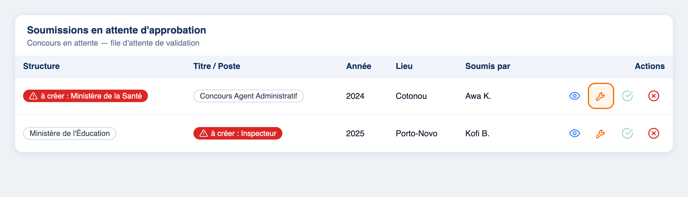
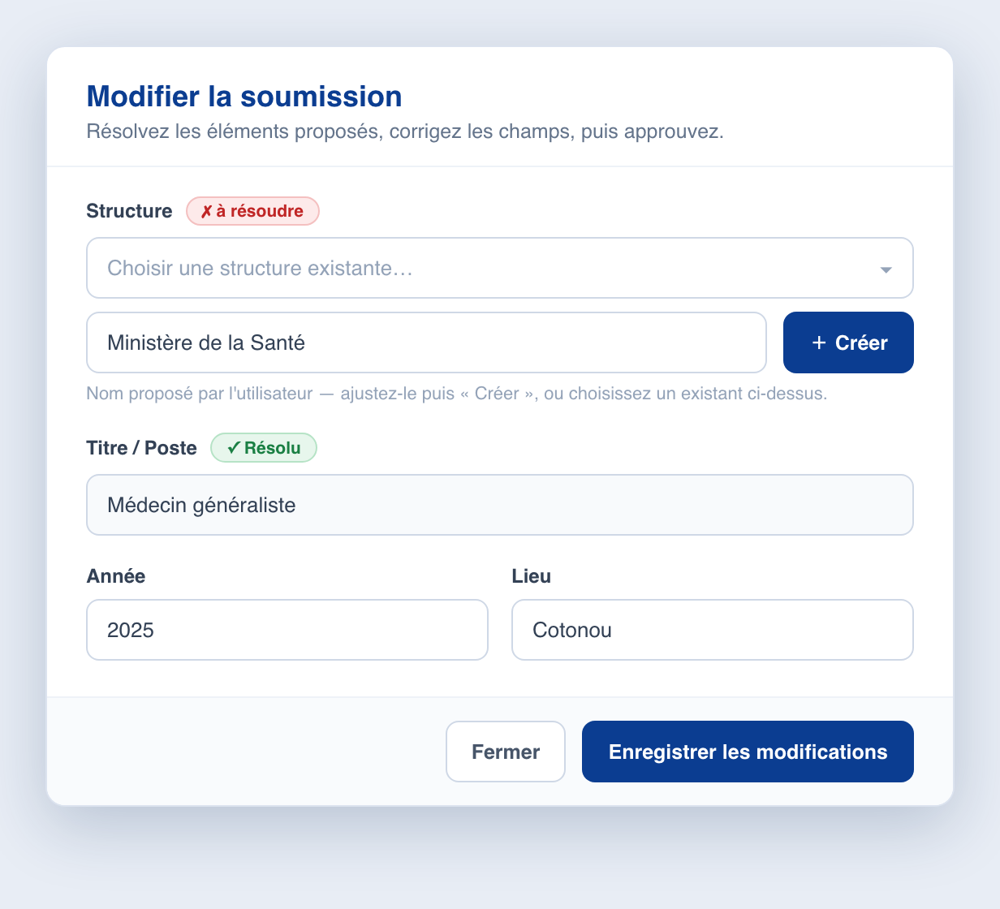
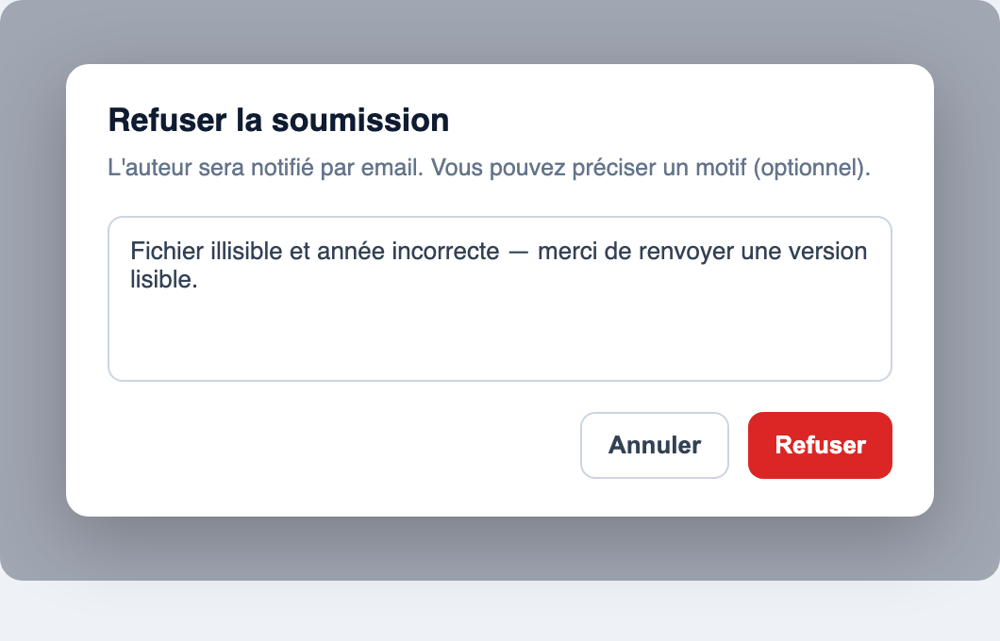

# Guide administrateur — Validation des demandes d'ajout de ressources

Ce guide s'adresse aux **administrateurs** du tableau de bord Edukia chargés de
**valider (approuver ou refuser)** les demandes d'ajout de ressources soumises
par les utilisateurs : les **épreuves** et les **concours**.

---

## 1. Le principe

Un utilisateur peut proposer une nouvelle ressource depuis l'application. Sa
demande arrive dans une **file d'attente** et n'est **pas encore publiée** :
elle attend qu'un administrateur la valide.

Pour chaque niveau d'une demande, l'utilisateur fournit **soit un élément
existant** (déjà dans le catalogue), **soit un nom proposé** (un élément qui
n'existe pas encore et qu'il faudra créer) :

- **Épreuve** : Établissement › Filière › Niveau d'étude › Matière, plus l'année
  et la session (section).
- **Concours** : Structure › Titre / Poste, plus l'année et le lieu.

Votre rôle : **résoudre** les éléments proposés (les rattacher à un élément réel
ou les créer), **corriger** au besoin les champs saisis, puis **approuver** la
demande (ce qui crée la vraie ressource) **ou la refuser** (en indiquant un
motif à l'auteur).

---

## 2. Accès

Dans le menu latéral, ouvrez la rubrique **Approbations** :

- **Épreuves en attente** — les demandes d'ajout d'épreuves.
- **Concours en attente** — les demandes d'ajout de concours.
- **Statistiques** — un aperçu chiffré des soumissions.

Chaque page affiche un tableau des demandes **en attente d'approbation**.

---

## 3. Lire une demande

Chaque ligne du tableau représente une demande. Les colonnes reprennent les
champs saisis par l'utilisateur (Structure, Titre, Année, Lieu… pour un
concours ; la chaîne Étab. › Filière › Niveau › Matière pour une épreuve).

Les champs sont affichés sous forme de **badges** :

| Badge | Signification |
|---|---|
| Badge **gris** avec le nom | L'élément **existe** déjà dans le catalogue — rien à faire. |
| Badge **rouge** « **à créer : …** » | L'utilisateur a **proposé un nouveau nom** ; l'élément n'existe pas encore. |
| Badge **rouge** « **… manquant(e)** » | Le niveau n'est ni renseigné ni proposé. |

> **À retenir :** tant qu'un champ est affiché **en rouge**, la ressource
> correspondante n'existe pas encore. Il faut la **résoudre** avant de pouvoir
> approuver la demande.

Un badge **« Fichier manquant »** signale qu'aucun fichier (PDF) n'a encore été
téléversé pour cette demande.

*Exemple : la 1re ligne a une **structure en rouge** (« à créer : Ministère de la
Santé ») qu'il faut résoudre ; le bouton 🔧 (encadré) ouvre l'édition.*

---

## 4. Les actions disponibles

Sur chaque ligne, à droite (colonne **Actions**), quatre boutons :

| Icône | Bouton | Rôle |
|---|---|---|
| 👁 (bleu) | **Voir le fichier soumis** | Ouvre le fichier (PDF) téléversé dans un nouvel onglet. |
| 🔧 (orange) | **Modifier / résoudre** | Ouvre la fenêtre d'édition de la demande. |
| ✅ (vert) | **Approuver** | Valide la demande et crée la vraie ressource. |
| ❌ (rouge) | **Refuser** | Rejette la demande (avec un motif). |

---

## 5. Modifier les informations saisies par l'utilisateur (bouton 🔧)

C'est l'étape centrale : **corriger et compléter les champs que l'utilisateur a
renseignés** au moment de sa demande, avant de l'approuver. Cliquez sur le
bouton **🔧 (Modifier / résoudre)** de la ligne — la fenêtre **« Modifier la
soumission »** s'ouvre.

Dans cette fenêtre, chaque niveau est présenté avec son statut : **badge vert
« ✓ Résolu »** s'il existe déjà, **badge rouge** s'il reste à résoudre.

### 5.1 Résoudre un élément affiché en rouge

Pour **chaque niveau en rouge** (structure, titre, ou — pour une épreuve —
établissement / filière / niveau / matière), deux possibilités :

1. **Rattacher un élément existant** — ouvrez la liste déroulante
   **« Choisir… existant(e) »** et sélectionnez l'élément déjà présent dans le
   catalogue. Le badge passe alors au **vert « ✓ Résolu »**.
2. **Créer l'élément proposé** — le nom proposé par l'utilisateur est
   **pré-rempli** dans le champ de texte ; ajustez-le si besoin (faute de
   frappe, casse…) puis cliquez sur **« + Créer »**. L'élément est créé **et**
   rattaché à la demande.

> **Anti-doublon :** si un élément du même nom existe déjà (à la casse près),
> il est **réutilisé automatiquement** au lieu d'en créer un nouveau.

### 5.2 Corriger l'année, le lieu et la session

Toujours dans la même fenêtre, vous pouvez **modifier les champs libres** que
l'utilisateur a saisis :

- **Concours** — les champs **Année** et **Lieu**. Après modification, cliquez
  sur **« Enregistrer les modifications »** en bas de la fenêtre.
- **Épreuve** — l'**Année** et la **Session** (section : *normale*,
  *rattrapage*…). L'**intitulé** de l'épreuve n'est **pas** à saisir : il est
  **recalculé automatiquement** à partir de la matière, de la session et de
  l'année.

### 5.3 Points importants

- Chaque **résolution** (rattachement ou création) est **enregistrée
  immédiatement** : nul besoin de « sauvegarder » séparément. Les modifications
  d'**année / lieu** se valident, elles, avec le bouton **« Enregistrer les
  modifications »**.
- Vous pouvez rouvrir la fenêtre autant de fois que nécessaire.
- Fermez la fenêtre avec **« Fermer »** une fois la demande complète.

> **Note :** seules les demandes **en attente** sont modifiables. Une demande
> déjà **approuvée** ou **refusée** est **figée** (lecture seule).

---

## 6. Approuver une demande (✅)

Le bouton **✅ (Approuver)** ne devient actif que lorsque **deux conditions**
sont réunies :

1. **Tous les niveaux sont résolus** (plus aucun badge rouge) —
   pour une épreuve, la matière doit être résolue ; pour un concours, la
   structure **et** le titre.
2. **Un fichier est présent** (le PDF de la ressource).

Si le bouton reste grisé, passez la souris dessus : une info-bulle vous indique
ce qui bloque (« Résolvez la structure et le titre d'abord », « En attente du
fichier »…).

À l'approbation :

- La **vraie ressource** (épreuve ou concours) est créée et devient visible par
  les utilisateurs.
- **L'auteur est notifié par email** que sa contribution a été approuvée.
- La demande disparaît de la file d'attente.

---

## 7. Refuser une demande avec un motif (❌)

Cliquez sur le bouton **❌ (Refuser)** : une fenêtre **« Refuser la soumission »**
s'ouvre.

- Saisissez un **motif du refus** (facultatif mais **recommandé**) dans la zone
  de texte — par exemple : « Fichier illisible », « Doublon avec une ressource
  existante », « Informations incorrectes »…
- Cliquez sur **Refuser** pour confirmer (ou **Annuler** pour revenir).

À la confirmation :

- La demande passe au statut **« Refusée »**.
- Le **motif est enregistré** et **envoyé à l'auteur par email**, afin qu'il
  comprenne **pourquoi** sa demande a été rejetée et puisse, le cas échéant,
  la corriger et la soumettre à nouveau.

> **Bonne pratique :** indiquez toujours un motif clair et courtois. C'est la
> seule explication que l'utilisateur recevra.

---

## 8. Voir le fichier soumis (👁)

Le bouton **👁 (Voir le fichier soumis)** ouvre le PDF téléversé par
l'utilisateur dans un nouvel onglet. **Vérifiez systématiquement le fichier**
(lisibilité, contenu, conformité) **avant d'approuver** une demande.

> Si votre navigateur bloque l'ouverture de l'onglet, autorisez les fenêtres
> pop-up pour le tableau de bord.

---

## 9. Bonnes pratiques

- **Vérifiez le fichier** avant toute approbation.
- **Réutilisez** les éléments existants plutôt que d'en créer de nouveaux :
  la fenêtre de résolution réutilise automatiquement un élément de même nom, ce
  qui évite les doublons dans le catalogue.
- **Corrigez** les fautes de frappe et incohérences via le bouton 🔧 avant
  d'approuver.
- **Motivez** chaque refus : l'auteur reçoit le motif par email.

---

## 10. Questions fréquentes

**Le bouton « Approuver » est grisé, pourquoi ?**
Il manque un élément à résoudre (badge rouge) ou le fichier n'a pas été
téléversé. L'info-bulle du bouton précise la cause.

**Puis-je modifier une demande déjà approuvée ou refusée ?**
Non. Seules les demandes **en attente** sont modifiables.

**Que voit l'utilisateur après ma décision ?**
Un email l'informe de l'approbation ou du refus. En cas de refus, l'email
contient le **motif** que vous avez saisi.

**Créer un élément va-t-il générer un doublon ?**
Non : si un élément du même nom existe déjà, il est réutilisé automatiquement.
